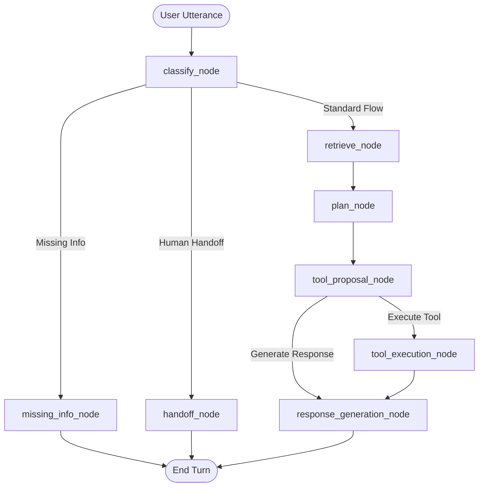

# AI Customer Success Orchestrator Skill

The AI Customer Success Orchestrator (`services/ai-orchestrator`) manages multi-topic conversational state across text chat, web portals, and voice interfaces using LangGraph state graphs and LLM-driven intelligence.

## System Architecture

## System Prompts & Markdown Organization

All system prompts are modularized inside `services/ai-orchestrator/src/ai_orchestrator/prompts/`:
- `intent_classifier.md`: LLM intent classification, entity extraction, sentiment analysis, and risk scoring.
- `tool_planner.md`: Policy-aware dynamic tool proposal and parameter binding.
- `clarifying_questions.md`: Empathetic conversational questions for missing parameters.
- `response_generator.md`: Grounded response synthesis across tool data and institutional RAG context.
- `human_handoff.md`: Seamless Four-Eyes policy governance and human specialist transfer messaging.

## Supported Canonical Intents

| Intent | Description | Sample Utterance | Primary Action / Tool |
| :--- | :--- | :--- | :--- |
| `account_orders` | List all orders on customer account | "what are my order in my account" | `list_customer_orders` |
| `order_status` | Single order status tracking | "where is package ORD-1001" | `get_order_status` |
| `order_cancellation` | Cancel or modify an order | "cancel order ORD-1001" | Escalates under Four-Eyes policy |
| `pricing_subscriptions` | Subscription tiers & pricing | "what are your monthly plans" | RAG Knowledge Retrieval |
| `troubleshooting` | Technical glitch assistance | "my gateway is offline" | RAG Knowledge Retrieval |
| `warranty_returns` | Warranty & replacement policy | "how does RMA replacement work" | RAG Knowledge Retrieval |
| `account_issues` | Password, login, profile updates | "change my account password" | RAG Knowledge Retrieval |
| `escalation_request` | Transfer to human agent | "I want to speak to human" | `handoff_node` |
| `greeting` | Conversational openers | "hello, good morning" | Grounded Greeting Response |

## Code Architecture
- `graph.py`: LangGraph workflow definition and async state nodes.
- `intents.py`: Asynchronous LLM-driven intent classifier with fallback.
- `prompt_loader.py`: Prompt file caching and loading utility.
- `tools.py`: OpenAI-compatible tool JSON schemas.
- `integration_client.py`: Async HTTP integration client to backend services.
