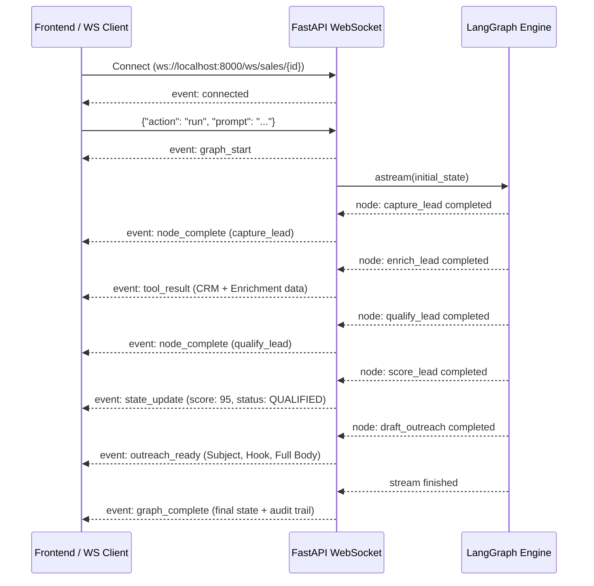

# AI Sales Assistant System Architecture
## Multi-Agent Business Automation Hub (LangGraph + LangChain + WebSockets + MCP)

---

## 1. Executive Overview

This architecture implements the **AI Sales Assistant** from the *AI Agent Engineering Workshop*. The architecture embodies the core principle taught in the workshop:

$$\text{Agent} = \text{LLM} + \text{Tools} + \text{State} + \text{Structured Outputs} + \text{Routing}$$

The system automates the complete B2B sales lifecycle:
**Lead Capture $\rightarrow$ CRM Enrichment $\rightarrow$ BANT Qualification $\rightarrow$ Quantitative Scoring $\rightarrow$ Personalized Outreach Generation**.

It is implemented as a production-grade multi-tier system:
- **`business-agent-server/`**: Python FastAPI backend running the LangGraph state machine, checkpointing memory, and WebSocket streaming server.
- **`business-agent-mcp/`**: Model Context Protocol (MCP) server providing standardized tools, business playbooks, and prompt templates to MCP clients (Claude Desktop, Cursor, Antigravity IDE).
- **`business-agent-web/`**: Next.js client interface with real-time streaming state visualization.

---

## 2. High-Level System Architecture Diagram

```mermaid
flowchart TD
    subgraph Clients["Client & Consumer Layer"]
        UI["Web App (Next.js / shadcn)"]
        IDE["MCP Clients (Claude Desktop / Cursor / Antigravity)"]
        API_CLIENT["REST / Curl Consumers"]
    end

    subgraph Server["business-agent-server (FastAPI)"]
        WS_GW["WebSocket Gateway (/ws/sales/{session_id})"]
        REST_GW["REST API Gateway (/api/v1/sales/*)"]
        
        subgraph GraphEngine["LangGraph State Machine"]
            START((START)) --> N1["1. capture_lead_node"]
            N1 --> N2["2. enrich_lead_node"]
            N2 --> N3["3. qualify_lead_node"]
            N3 --> N4["4. score_lead_node"]
            
            N4 --> COND{route_by_qualification}
            
            COND -- "score >= 65" --> N5A["5a. draft_outreach_node"]
            COND -- "35 <= score < 65" --> N5B["5b. nurture_lead_node"]
            COND -- "score < 35" --> N5C["5c. archive_lead_node"]
            
            N5A --> END((END))
            N5B --> END
            N5C --> END
            
            CHECKPOINT[("LangGraph MemorySaver Checkpointer")] -. Thread State .-> GraphEngine
        end
        
        subgraph Tools["LangChain Tool Execution Layer"]
            T_CRM["crm_lookup_lead"]
            T_ENRICH["enrich_company_profile"]
            T_SCORE["calculate_lead_score"]
        end
        
        N2 -. Invokes .-> T_CRM
        N2 -. Invokes .-> T_ENRICH
        N4 -. Invokes .-> T_SCORE
    end

    subgraph MCP["business-agent-mcp (Model Context Protocol)"]
        MCP_RPC["MCP Dispatcher (JSON-RPC 2.0 / Stdio / HTTP)"]
        MCP_TOOLS["MCP Tools Catalog"]
        MCP_RES["MCP Resources (business://sales/*)"]
        MCP_PROMPTS["MCP Prompt Templates"]
        
        MCP_RPC --- MCP_TOOLS
        MCP_RPC --- MCP_RES
        MCP_RPC --- MCP_PROMPTS
        MCP_TOOLS -. Delegates Execution .-> Tools
    end

    UI <== "WebSocket Live Events" ==> WS_GW
    UI <== "HTTP Requests" ==> REST_GW
    API_CLIENT ==> REST_GW
    IDE <== "MCP Protocol (Stdio / SSE)" ==> MCP_RPC
    WS_GW --> GraphEngine
    REST_GW --> GraphEngine
```

---

## 3. LangGraph State Machine Specification

### 3.1 State Schema (`SalesAgentState`)
The agent state is defined as a typed dictionary with additive reducers:

```python
class SalesAgentState(TypedDict):
    messages: Annotated[List[BaseMessage], operator.add]
    lead_input: Dict[str, Any]
    crm_record: Dict[str, Any]
    enriched_data: Dict[str, Any]
    qualification: Dict[str, Any]
    score: int
    status: str            # "qualified" | "nurture" | "disqualified"
    outreach_plan: Dict[str, Any]
    current_node: str
    audit_trail: Annotated[List[str], operator.add]
    error: Optional[str]
```

### 3.2 Graph Nodes

| Node Name | Responsibility | Tools / Dependencies |
| :--- | :--- | :--- |
| `capture_lead` | Normalizes input payload; extracts contact email & target company | Regex / String parser |
| `enrich_lead` | Retrieves existing CRM records & enriches domain metadata | `crm_lookup_lead`, `enrich_company_profile` |
| `qualify_lead` | Assesses BANT criteria (Budget, Authority, Need, Timeline) | Domain heuristics / LLM reasoning |
| `score_lead` | Computes quantitative score (0-100) & determines routing verdict | `calculate_lead_score` |
| `draft_outreach` | Writes personalized cold email pitch for qualified leads | LangChain LLM / Playbook generator |
| `nurture_lead` | Prepares 30-day educational drip strategy for warm leads | Playbook templates |
| `archive_lead` | Logs disqualification rationale and archives lead | CRM audit logger |

### 3.3 Conditional Branching Logic
```python
def route_by_qualification(state: SalesAgentState) -> str:
    status = state.get("status", "nurture").lower()
    if status == "qualified":
        return "draft_outreach"
    elif status == "nurture":
        return "nurture_lead"
    else:
        return "archive_lead"
```

---

## 4. Real-Time WebSocket Streaming Protocol

### Endpoint: `ws://localhost:8000/ws/sales/{session_id}`

#### Client-to-Server Message Format
```json
{
  "action": "run",
  "prompt": "Please qualify lead Alex Mercer from Acme Corp: alex@acmecorp.com",
  "lead": {
    "email": "alex@acmecorp.com",
    "name": "Alex Mercer",
    "company": "Acme Corp",
    "estimated_budget": 50000,
    "timeline_months": 2,
    "has_decision_authority": true
  }
}
```

#### Server-to-Client Event Lifecycle



---

## 5. Model Context Protocol (MCP) Specification

The MCP server in `business-agent-mcp/` conforms to protocol version `2024-11-05` (JSON-RPC 2.0).

### 5.1 Exposed Tools (`tools/list` & `tools/call`)
1. **`crm_lookup_lead`**: Query account data, historical deals, and lifecycle stage by email.
2. **`enrich_company_profile`**: Extract headcount, ARR, tech stack, and pain points by domain.
3. **`calculate_lead_score`**: Quantify BANT score using weighted factors (Authority: 30%, Budget: 30%, Timeline: 25%, Size: 15%).
4. **`run_sales_assistant`**: Run the end-to-end LangGraph assistant.

### 5.2 Exposed Resources (`resources/list` & `resources/read`)
- `business://sales/playbook`: Core sales playbook, Ideal Customer Profile (ICP), and BANT scoring thresholds.
- `business://sales/pricing-tiers`: Pricing packages, agent quotas, and SLA definitions.
- `business://sales/objection-handling`: Battle cards for enterprise objections (cost, security, implementation speed).

### 5.3 Exposed Prompts (`prompts/list` & `prompts/get`)
- `qualify-sales-lead`: Prompt for evaluating BANT criteria with given role and budget.
- `draft-sales-outreach`: Prompt for generating customized cold email copy.

---

## 6. REST API Reference

| Method | Endpoint | Description |
| :--- | :--- | :--- |
| `POST` | `/api/v1/sales/run` | Execute the sales assistant workflow with a prompt or structured lead |
| `POST` | `/api/v1/sales/lead` | Convenience endpoint to qualify a structured `LeadInput` |
| `GET` | `/api/v1/sales/state/{session_id}` | Retrieve checkpointed state snapshot from `MemorySaver` |
| `GET` | `/api/v1/sales/tools` | Inspect all registered sales tools and parameter schemas |
| `GET` | `/health` | Server health check and version metadata |

---

## 7. Project Layout & Responsibility Segregation

```
Business-Agents/
├── ARCHITECTURE.md                  # Master System Architecture (this document)
├── README.md                        # Workshop guide & Quickstart
│
├── business-agent-server/           # ALL Python backend, venv & LangGraph code
│   ├── .venv/                       # Dedicated Python virtual environment
│   ├── requirements.txt             # Dependencies (FastAPI, LangGraph, LangChain, etc.)
│   ├── .env.example                 # Configuration template
│   ├── app/
│   │   ├── main.py                  # FastAPI server with CORS & routes
│   │   ├── config.py                # Pydantic settings
│   │   ├── schemas/
│   │   │   ├── sales_models.py      # LeadInput, Qualification, Outreach schemas
│   │   │   └── events.py            # WebSocket event envelopes
│   │   ├── tools/
│   │   │   └── sales_tools.py       # LangChain tools (@tool decorated)
│   │   ├── graph/
│   │   │   ├── state.py             # SalesAgentState (TypedDict)
│   │   │   ├── nodes.py             # LangGraph nodes & conditional router
│   │   │   └── sales_graph.py       # StateGraph compilation & MemorySaver
│   │   ├── websocket/
│   │   │   ├── manager.py           # Real-time WebSocket connection manager
│   │   │   └── router.py            # /ws/sales/{session_id} streaming route
│   │   └── api/
│   │       └── sales_routes.py      # REST endpoints (/api/v1/sales/*)
│   └── tests/
│       ├── test_sales_tools.py      # Unit tests for tools
│       ├── test_sales_graph.py      # Integration tests for LangGraph state machine
│       └── test_sales_api.py        # REST API endpoint tests
│
├── business-agent-mcp/              # ALL Model Context Protocol files
│   ├── server.py                    # MCP JSON-RPC 2.0 server (Stdio & HTTP)
│   ├── tools.py                     # MCP Tools catalog
│   ├── resources.py                 # MCP Resources (playbooks, pricing)
│   ├── prompts.py                   # MCP Prompts (qualification, outreach)
│   ├── mcp_config.json              # Config file for Claude Desktop / Cursor
│   ├── README.md                    # MCP integration instructions
│   └── test_mcp.py                  # Automated test suite for MCP protocol
│
└── business-agent-web/              # Next.js web application
    ├── app/                         # Frontend pages
    └── components/                  # shadcn/ui components
```
