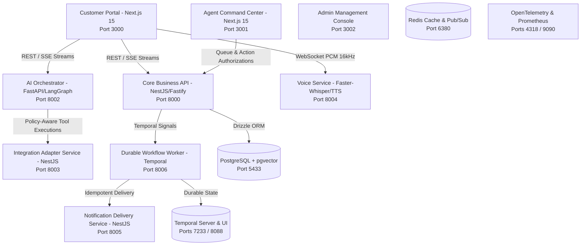

# Intelligent Customer Success & Service Automation

An advanced, enterprise-grade omnichannel AI-powered customer success and service automation platform built as a polyglot monorepo. This system integrates real-time web support, conversational voice streaming, durable business workflow automation, and human-in-the-loop agent escalations into a single cohesive architecture.

---

## Architecture Overview



---

## Core Technology Stack & Capabilities

- **Frontend Portals (`apps/*`)**: Built with **Next.js 15 (App Router)** and TypeScript, featuring sleek glassmorphism UI designs, Server-Sent Events (SSE) chat streaming relay, real-time wave audio visualization, and interactive agent escalation queues.
- **Business Gateways (`services/core-api`, `integration-service`, `notification-service`)**: Built with **NestJS + Fastify adapter** and **Drizzle ORM** connecting to 5 domain-separated PostgreSQL schemas (`customer`, `conversation`, `case_management`, `policy`, `audit`). Includes automated OpenAPI Swagger generation, correlation ID propagation, and Zod input validation.
- **Stateful AI Orchestration (`services/ai-orchestrator`)**: Built with **Python 3.12, FastAPI, LangGraph, and LangChain**. Integrates with OpenAI-compatible inference models (`gemini-2.5-flash`, `gpt-4o-mini-tts`, `gpt-4.1-nano`). Supports automated intent classification, missing parameter follow-up loops, grounded citation synthesis, and tool policy authorization.
- **Real-Time Voice Streaming (`services/voice-service`)**: Features bi-directional WebSocket streaming (`pcm_s16le` at 16kHz), **Faster-Whisper Speech-to-Text (STT)**, real-time sentence-level **Text-to-Speech (TTS)** audio streaming, Energy/RMS Voice Activity Detection (VAD) with pre-speech buffering, and immediate barge-in interruption handling.
- **Durable Business Workflows (`services/workflow-worker`)**: Powered by **Temporal** SDK to execute multi-step resilient processes (`WarrantyClaimWorkflow`, `RefundReviewWorkflow`, `OrderProcessingWorkflow`) with automatic retries, timeout safeguards, and real-time signals triggered by human supervisor approvals in the Agent Console.
- **Security & Telemetry Hardening (`packages/observability`, `auth`)**: Includes an automated **AI Security Shield** (detecting and blocking adversarial prompt injection and jailbreak attacks with HTTP 400/429), regex-based **PII Redaction Engine** (masking SSNs and credit cards in log traces), sliding-window **DDoS Rate Limiters**, and standard **Prometheus / OpenTelemetry metrics** exporters across Node.js and Python services.
- **Monorepo Engine**: Powered by **pnpm workspaces**, **Turborepo (v2.10.8)**, and Python virtual environments (`.venv`).

---

##  Repository Layout

```text
├── apps/
│   ├── customer-web/          # Customer chat & live microphone portal (port 3000)
│   ├── agent-console/         # 3-column human agent command center (port 3001)
│   └── admin-console/         # Platform governance & management (port 3002)
├── services/
│   ├── core-api/              # NestJS/Fastify business domain API (port 8000)
│   ├── ai-orchestrator/       # Python FastAPI + LangGraph conversation core (port 8002)
│   ├── integration-service/   # Canonical CRM & order adapters (port 8003)
│   ├── voice-service/         # Real-time WebSocket audio VAD/STT/TTS engine (port 8004)
│   ├── notification-service/  # Transactional messaging & templates (port 8005)
│   ├── workflow-worker/       # Temporal resilient background workflows (port 8006)
│   └── knowledge-service/     # FastAPI + pgvector retrieval service (port 8001 / 8200)
├── packages/                  # Shared TypeScript packages (contracts, events, auth, logger, observability, ui)
├── python-packages/           # Shared Python libraries (ai-contracts, ai-observability, rag-core, service-auth)
├── infrastructure/            # Docker Compose, init scripts, database schemas, and monitoring manifests
├── docs/                      # Architectural documentation, specifications, and runbooks (00 through 26)
├── adr/                       # Architectural Decision Records (ADRs 0001 - 0004)
├── compose.yaml               # Local development infrastructure configuration
└── package.json               # Root workspace commands and scripts
```

---

## Quick Start Guide

### 1. Prerequisites
- Node.js 20+ & pnpm 9+
- Python 3.12+
- Docker & Docker Compose

### 2. Infrastructure Setup & Installation

```bash
# Clone the repository and install Node/TS workspace dependencies
pnpm install

# Start local infrastructure (PostgreSQL+pgvector, Redis, Temporal Server/UI, NATS, OTel)
docker compose up -d
docker compose ps

# Push database schema tables to local PostgreSQL instance
pnpm --filter @csp/core-api db:push
```

### 3. One-Click System Launch & Interactive Logs

To launch all local Docker infrastructure, Node/TypeScript frontends, NestJS microservices, and Python AI + Voice engines concurrently in a single interactive terminal window:

```bash
# Execute the automated multi-service shell runner (or run: pnpm start)
./run_all_services.sh
```

- **Interactive Combined Logs**: Displays real-time color-coded streams (`[NODE-STACK]`, `[AI-ORCH]`, `[VOICE-ENGINE]`) side-by-side.
- **Instant Clean Shutdown**: When you press **`Ctrl + C`** or close the shell window, the runner traps the interruption signal and immediately closes and cleans up all running services without leaving orphaned background processes.

#### Alternative: Running Services Individually
```bash
# Terminal 1: All TypeScript frontends and Node.js microservices
pnpm dev

# Terminal 2: Python AI Orchestrator service
cd services/ai-orchestrator && PYTHONPATH="src:../../python-packages/ai-contracts/src" ../voice-service/.venv/bin/uvicorn ai_orchestrator.main:app --port 8002 --reload

# Terminal 3: Python Voice Service
cd services/voice-service && PYTHONPATH="src:../../python-packages/ai-contracts/src" .venv/bin/uvicorn voice_service.main:app --port 8004 --reload
```

---

## Comprehensive Verification & Testing Schedule

Our platform maintains strict CI quality gates across both TypeScript and Python runtimes:

```bash
# Run complete Monorepo Linter, Typechecker, Build, and Unit/E2E test suites
pnpm test && pnpm build && pnpm typecheck && pnpm lint

# Run Python AI Orchestrator verification tests
cd services/ai-orchestrator && PYTHONPATH="src:../../python-packages/ai-contracts/src" ../voice-service/.venv/bin/pytest tests -v

# Run Python Voice Service audio engine tests
cd services/voice-service && PYTHONPATH="src:../../python-packages/ai-contracts/src" .venv/bin/pytest tests -v
```

---

## Documentation & Reference Guides

| Guide | Description & Link |
| :--- | :--- |
| **System Launch Guide** | [docs/26-system-launch-guide.md](docs/26-system-launch-guide.md) — Operational runbook and live configuration schedule |
| **Testing Strategy & E2E Specs** | [docs/20-testing-strategy.md](docs/20-testing-strategy.md) — Complete description of integration test layers |
| **Security & Privacy Shield** | [docs/17-security.md](docs/17-security.md) — AI prompt injection defense and PII scrubbing rules |
| **Observability & Telemetry** | [docs/18-observability.md](docs/18-observability.md) — Prometheus metrics exporters and OpenTelemetry tracing |
| **Roadmap Tracker** | [docs/progress.md](docs/progress.md) — Detailed verification log of all 10 completed project phases |

---
*Built by Google DeepMind Advanced Agentic Coding / Antigravity via pair programming.*
