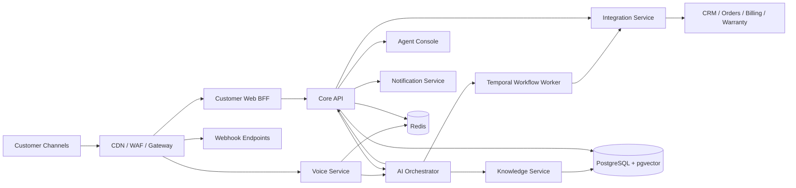
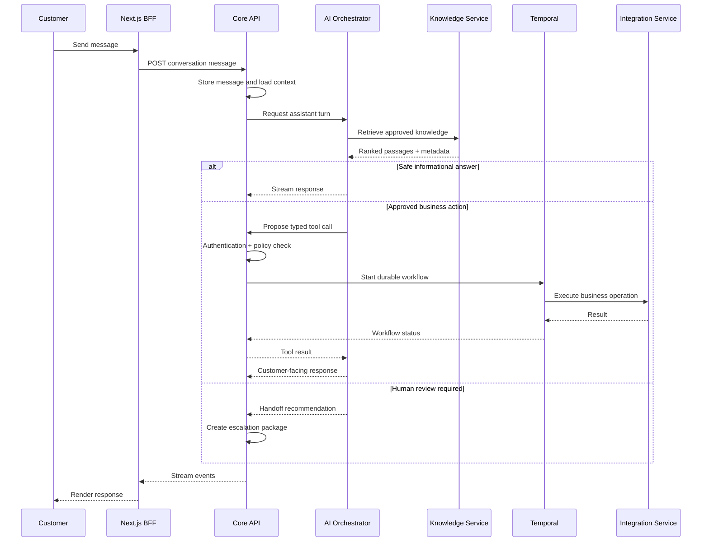

# System Overview

## Objective

The platform is the first point of contact for customers across web chat, voice, email, and support portals. It answers grounded questions, gathers missing information, performs approved actions, and transfers sensitive or uncertain cases to human agents with full context.

## High-level architecture

## Responsibility model

- **Next.js applications** own user experience, browser sessions, frontend-specific aggregation, and streaming presentation.
- **Kong or a managed gateway** owns TLS, routing, coarse rate limits, WebSocket forwarding, and perimeter controls.
- **Core API** owns customers, conversations, messages, cases, policies, human handoffs, permissions, and audit records.
- **AI Orchestrator** owns conversational reasoning, LangGraph state transitions, model invocation, tool selection, and escalation recommendations.
- **Knowledge Service** owns approved document ingestion, chunking, embeddings, retrieval, reranking, and knowledge-version controls.
- **Voice Service** owns audio sessions, VAD, endpoint detection, faster-whisper, TTS, playback coordination, and customer interruption handling.
- **Temporal Worker** owns durable multi-step business processes and retries.
- **Integration Service** owns external-system adapters and canonical business-operation APIs.
- **Notification Service** owns message templates, provider adapters, delivery attempts, and delivery events.

## Core interaction flow

## Design principles

1. The LLM may understand and propose; policy-controlled services authorize and execute.
2. Irreversible actions require explicit confirmation and, when configured, human approval.
3. Organizational knowledge must be versioned, region-aware, permission-aware, and traceable.
4. Each service owns its data and exposes behavior through contracts rather than shared internal tables.
5. Conversation context, workflow state, and model prompts are different concerns and must be stored separately.
6. Every cross-service request carries a trace ID, correlation ID, conversation ID, and idempotency key when applicable.
