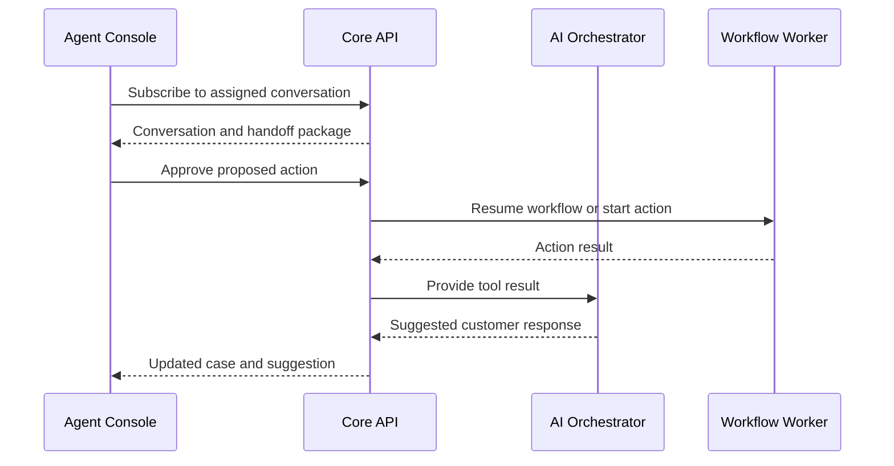

# Agent Console

## Purpose

The agent console allows human representatives to receive AI escalations, understand the case quickly, continue the conversation, approve controlled actions, and resolve cases.

## Main capabilities

- Handoff queue with routing and priority
- Customer profile and authentication state
- Conversation transcript across channels
- AI-generated summary and unresolved questions
- Relevant orders, subscriptions, warranties, and cases
- Retrieved organizational sources
- Suggested replies and troubleshooting steps
- Tool approval or rejection
- Internal notes invisible to the customer
- Supervisor transfer and case reassignment

## Data flow



## Handoff package

Required fields:

```text
conversationId
caseId
customerId
authenticationLevel
activeIntent
secondaryIntents
sentiment
riskLevel
summary
informationCollected
missingInformation
actionsAttempted
relevantBusinessObjects
retrievedSources
escalationReason
recommendedNextAction
```

## Approval experience

Agents must see the exact proposed tool, validated arguments, business impact, policy reason, and audit implications before approving. Editing arguments must trigger revalidation.

## Security

- Enforce role and queue membership server-side.
- Mask sensitive customer data by role.
- Require stronger authentication for high-risk actions.
- Record all transcript views, exports, approvals, and edits.

## Tests

Test queue assignment, concurrent agent takeover, action approval, stale data, permission denial, transcript redaction, and customer reconnection.
