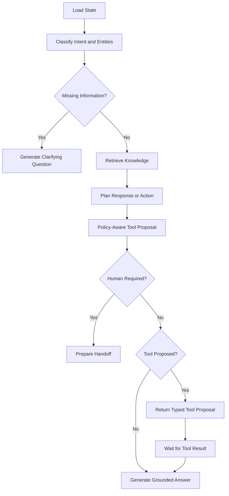

# AI Orchestrator

## Purpose

The AI Orchestrator is a Python/FastAPI service that manages conversation reasoning using LangGraph and LangChain. It does not directly perform privileged business operations.

## Technology

- FastAPI and Pydantic
- LangGraph for stateful control flow
- LangChain for model, prompt, tool, retriever, and structured-output integrations
- PostgreSQL-backed LangGraph checkpoints
- Redis for short-lived caches and cancellation signals
- Optional LangSmith for AI tracing and evaluation

## Main graph



## State model

```python
class SupportState(TypedDict, total=False):
    conversation_id: str
    customer_id: str
    channel: str
    messages: list[BaseMessage]
    active_intent: str
    secondary_intents: list[str]
    entities: dict[str, Any]
    missing_fields: list[str]
    authentication_level: int
    sentiment: str
    risk_level: str
    retrieved_documents: list[dict[str, Any]]
    proposed_tool: str | None
    proposed_tool_input: dict[str, Any] | None
    tool_result: dict[str, Any] | None
    requires_human: bool
    escalation_reason: str | None
    final_response: str | None
```

## APIs

```text
POST /internal/v1/assistant/turns
POST /internal/v1/assistant/turns/{turnId}/tool-result
POST /internal/v1/assistant/turns/{turnId}/cancel
GET  /internal/v1/assistant/turns/{turnId}/events
POST /internal/v1/evaluations/run
```

## Tool design

Each tool definition contains:

```text
tool name
description
input schema
output schema
required authentication level
confirmation requirement
human-approval requirement
timeout
idempotency behavior
audit category
```

The orchestrator returns proposals; Core API authorizes and executes them.

## Memory model

- **Thread state:** LangGraph checkpoint keyed by conversation ID.
- **Durable conversation history:** Core API database.
- **Long-term customer memory:** explicit, policy-controlled customer preferences only.
- **Knowledge:** retrieved from Knowledge Service, not stored as conversation memory.

## Guardrails

- Structured outputs for intent, entities, plans, and tools
- Maximum graph steps
- Tool allow-list
- Prompt-injection detection and document-instruction isolation
- Source and freshness requirements
- PII redaction before tracing
- Low-confidence escalation
- Conflict detection among retrieved sources

## Evaluation

Measure intent accuracy, entity accuracy, groundedness, citation correctness, policy compliance, tool-selection precision, escalation quality, latency, and token cost.

Maintain golden conversation datasets covering follow-ups, interruptions, topic switching, conflicting documents, tool failures, and adversarial prompts.
