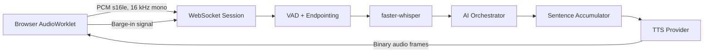

# Voice Service

## Purpose

The Voice Service manages live audio sessions, browser or telephony audio ingestion, voice activity detection, endpointing, faster-whisper transcription, response audio generation, and customer interruption handling.

## Technology

- FastAPI WebSockets
- faster-whisper
- Silero VAD or equivalent server VAD
- NumPy and soundfile
- Redis for session and cancellation state
- Managed or self-hosted TTS provider
- OpenTelemetry

## Architecture



## Session creation

The customer web BFF requests a voice session from Core API. Core API returns:

```text
sessionId
conversationId
short-lived token
WebSocket URL
expiry
supported codecs
```

The token is scoped only to that voice session and cannot invoke business APIs.

## Audio protocol

Input audio:

```text
encoding: pcm_s16le
sample rate: 16000
channels: 1
frame duration: approximately 20 ms
transport: binary WebSocket frames
```

Control and state messages use JSON text frames.

## State machine

```text
CONNECTING -> CALIBRATING -> LISTENING -> SPEECH_DETECTED
-> TRANSCRIBING -> THINKING -> SPEAKING -> LISTENING

SPEAKING -> INTERRUPTING -> LISTENING
ANY -> CLOSED
```

## Endpointing defaults

```text
minimum speech: 250 ms
end-of-speech silence: 600 ms
maximum utterance: 30 seconds
pre-speech buffer: 200 ms
```

These values must be tuned using real call recordings and language-specific evaluation.

## faster-whisper configuration

Development:

```text
model: small
device: cpu
compute_type: int8
```

Production balanced:

```text
model: distil-large-v3 or turbo
device: cuda
compute_type: float16
```

Load the model during service startup. Consume the transcription segment generator fully. Use bounded concurrency per GPU.

## Barge-in

While assistant audio is playing, microphone capture remains active with browser echo cancellation. When sustained customer speech is detected:

1. Cancel active AI generation.
2. Cancel TTS generation.
3. Clear queued browser playback for the response ID.
4. Mark the previous response as interrupted.
5. Capture and transcribe the new customer utterance.
6. Resume the same LangGraph conversation thread.

## APIs

```text
POST      /internal/v1/voice/sessions
GET       /internal/v1/voice/sessions/{id}
DELETE    /internal/v1/voice/sessions/{id}
WEBSOCKET /voice/v1/sessions/{id}
GET       /health/live
GET       /health/ready
```

## WebSocket events

Browser to server:

```text
session.start
response.cancel
session.stop
binary PCM audio
```

Server to browser:

```text
session.ready
input_audio.speech_started
input_audio.speech_stopped
transcript.final
response.text.delta
response.audio.started
binary response audio
response.completed
error
```

## Scaling

For the MVP, one service can own WebSockets, STT, and TTS. At higher volume, separate connection pods from GPU STT workers and TTS workers. Keep the active media connection out of Kafka; use Redis or NATS for short-lived coordination.

## Metrics

Track active sessions, speech duration, STT latency, language confidence, AI first-token latency, TTS first-audio latency, total first-audio latency, barge-in count, no-speech timeouts, GPU utilization, and disconnect reasons.

## Tests

- PCM decoding and resampling
- VAD and endpointing fixtures
- Noisy-room and silence cases
- Language detection
- Barge-in cancellation
- Stale audio-chunk rejection
- WebSocket reconnect and token expiry
- GPU worker saturation
- End-to-end synthetic audio tests
