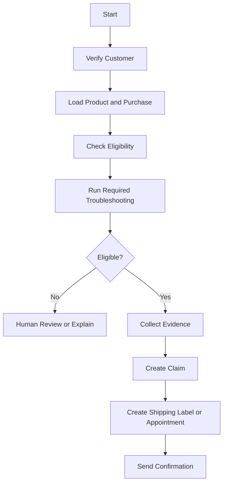

# Workflow Worker

## Purpose

The Workflow Worker uses Temporal to run durable business processes that can survive failures, wait for external systems, request approval, retry safely, and execute compensation steps.

## Example workflows

```text
RefundReviewWorkflow
WarrantyClaimWorkflow
SubscriptionCancellationWorkflow
TechnicianBookingWorkflow
AccountRecoveryWorkflow
HumanApprovalWorkflow
```

## Workflow boundary

LangGraph decides that a business process should begin. Core API authorizes it. Temporal executes it.

## Example warranty workflow



## Workflow rules

- Workflows are deterministic.
- External I/O occurs in activities.
- Every activity has a timeout and retry policy.
- Non-idempotent activities require idempotency keys.
- Compensation logic is explicit.
- Workflow IDs map to business objects and are stored by Core API.

## APIs and signals

Core API starts workflows through an internal client. Human agents can send signals such as:

```text
approve
reject
request_more_information
cancel
reschedule
```

## Events

```text
workflow.started
workflow.waiting_for_customer
workflow.waiting_for_approval
workflow.completed
workflow.failed
workflow.cancelled
```

## Tests

Use Temporal's test environment for time skipping, retry behavior, approval waits, cancellation, compensation, and deterministic replay.
