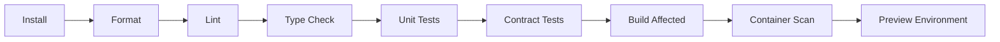

# CI/CD

## Pull-request pipeline

Use Turborepo affected-task execution for TypeScript packages and uv-locked environments for Python services.

## Main-branch pipeline

1. Build immutable versioned images.
2. Generate SBOMs and provenance metadata.
3. Push to the container registry.
4. Deploy to staging.
5. Run smoke, integration, E2E, and AI regression tests.
6. Require policy or human approval.
7. Deploy using rolling, blue-green, or canary strategy.
8. Verify SLIs and automatically halt or roll back on regression.

## Database deployment

Run backward-compatible migrations before application rollout. Destructive migrations require a separate later release.

## Prompt and graph deployment

Treat prompts, retrieval settings, and LangGraph definitions as versioned release artifacts. Activation should be observable and reversible without rebuilding unrelated services when possible.

## Voice model deployment

Warm new STT workers before shifting traffic. Verify CUDA compatibility, model checksum, startup time, and GPU memory limits.
